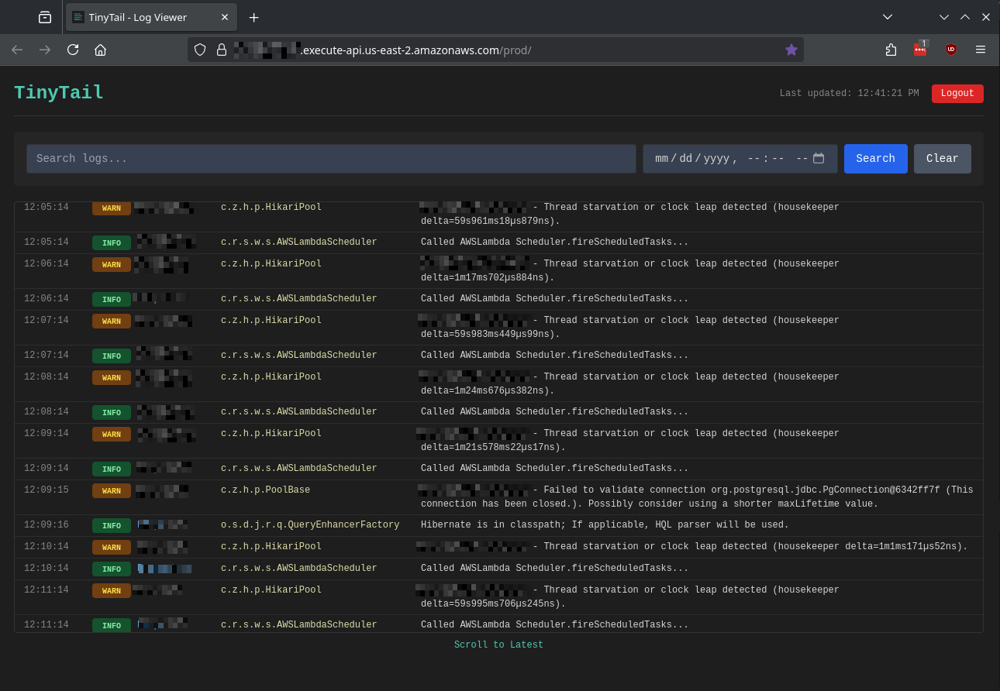
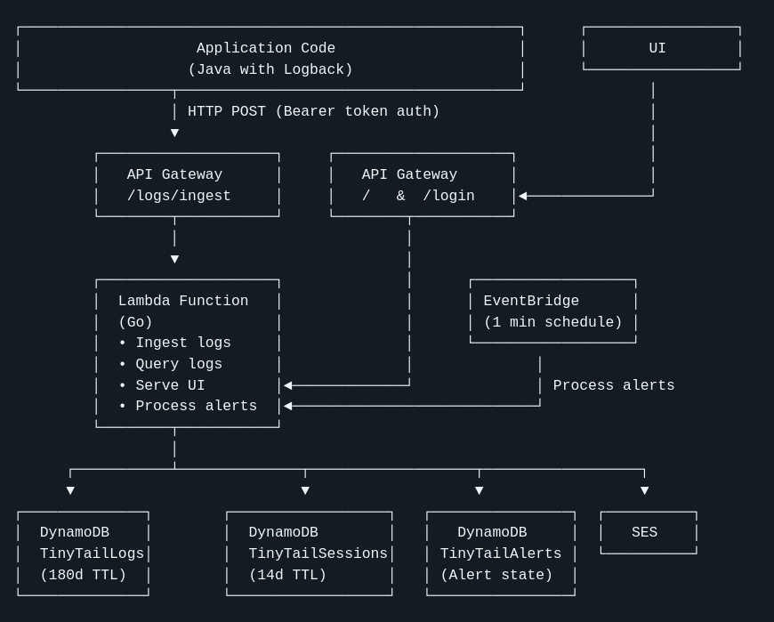

# TinyTail

A completely serverless, low-cost log viewing system built on AWS Lambda and DynamoDB.  Replace expensive log aggregation services with a simple, self-hosted solution that fits within the AWS Free Tier.



> **Status**: Production-ready. Actively used in production environments.

## Intended Audience

TinyTail is perfect for:

- **Small teams** tired of paying $15-50/month for basic log aggregation
- Developers who find **AWS CloudWatch's UI clunky** and want a simpler log viewer
- Teams currently using **Papertrail, Loggly, or Datadog** who want to cut costs
- **Cost-conscious startups** that need simple log management without the SaaS pricing
- Projects with **moderate log volumes** (< 10GB/month) that fit comfortably in AWS Free Tier

**Not ideal for:**
- Enterprise teams needing advanced features (log analytics, complex alerting, compliance)
- High-volume applications - consider dedicated solutions
- Teams without any AWS experience

## Features

- **🔐 Password-protected UI**: Secure web interface with session-based authentication
- **📊 Live tail view**: Real-time log streaming with auto-refresh
- **🔍 Search capabilities**: Full-text search and date-based filtering
- **📧 Email alerts**: Pattern-based alerts via SES
- **💰 Cost effective**: 0/month for <1GB logs (Free Tier) or ~$3-5/month beyond that
- **☁️ Serverless**: No infrastructure to manage
- **📦 Large message support**: Handles large Java stack traces (>350KB split into sequential entries)
- **🚀 Simple deployment**: One command to deploy everything
- **⏱️ Smart pagination**: Scroll-based log navigation with ULID timestamps
- **🎨 Modern UI**: Alpine.js + TailwindCSS with live tail mode

## Architecture



## Prerequisites

- AWS CLI configured with credentials
- AWS SAM CLI installed ([installation guide](https://docs.aws.amazon.com/serverless-application-model/latest/developerguide/install-sam-cli.html))
- Go 1.21+ (for building Lambda function)
- OpenSSL (for secret generation)
- Java 17 + Gradle 8 (for logback appender)

## IAM User Setup

Create a dedicated IAM user for TinyTail deployments with the following permissions:

### Required Policy

Create a custom IAM policy with least-privilege permissions for TinyTail:

```json
{
  "Version": "2012-10-17",
  "Statement": [
    {
      "Sid": "CloudFormationAccess",
      "Effect": "Allow",
      "Action": [
        "cloudformation:CreateStack",
        "cloudformation:UpdateStack",
        "cloudformation:DeleteStack",
        "cloudformation:DescribeStacks",
        "cloudformation:DescribeStackEvents",
        "cloudformation:DescribeStackResources",
        "cloudformation:GetTemplate",
        "cloudformation:ValidateTemplate",
        "cloudformation:CreateChangeSet",
        "cloudformation:DescribeChangeSet",
        "cloudformation:ExecuteChangeSet"
      ],
      "Resource": [
        "arn:aws:cloudformation:*:*:stack/tinytail/*",
        "arn:aws:cloudformation:*:*:stack/tinytail"
      ]
    },
    {
      "Sid": "S3DeploymentBuckets",
      "Effect": "Allow",
      "Action": [
        "s3:CreateBucket",
        "s3:ListBucket",
        "s3:GetBucketLocation",
        "s3:GetBucketVersioning",
        "s3:PutBucketVersioning",
        "s3:GetObject",
        "s3:PutObject",
        "s3:DeleteObject"
      ],
      "Resource": [
        "arn:aws:s3:::tinytail-deployments",
        "arn:aws:s3:::tinytail-deployments/*",
        "arn:aws:s3:::aws-sam-cli-managed-default-*",
        "arn:aws:s3:::aws-sam-cli-managed-default-*/*"
      ]
    },
    {
      "Sid": "LambdaManagement",
      "Effect": "Allow",
      "Action": [
        "lambda:CreateFunction",
        "lambda:DeleteFunction",
        "lambda:GetFunction",
        "lambda:UpdateFunctionCode",
        "lambda:UpdateFunctionConfiguration",
        "lambda:ListVersionsByFunction",
        "lambda:PublishVersion",
        "lambda:AddPermission",
        "lambda:RemovePermission",
        "lambda:GetFunctionConfiguration",
        "lambda:TagResource",
        "lambda:UntagResource"
      ],
      "Resource": "arn:aws:lambda:*:*:function:tinytail"
    },
    {
      "Sid": "IAMRoleManagement",
      "Effect": "Allow",
      "Action": [
        "iam:CreateRole",
        "iam:DeleteRole",
        "iam:GetRole",
        "iam:PassRole",
        "iam:AttachRolePolicy",
        "iam:DetachRolePolicy",
        "iam:PutRolePolicy",
        "iam:DeleteRolePolicy",
        "iam:GetRolePolicy",
        "iam:TagRole",
        "iam:UntagRole"
      ],
      "Resource": [
        "arn:aws:iam::*:role/tinytail-*"
      ]
    },
    {
      "Sid": "DynamoDBManagement",
      "Effect": "Allow",
      "Action": [
        "dynamodb:CreateTable",
        "dynamodb:DeleteTable",
        "dynamodb:DescribeTable",
        "dynamodb:UpdateTable",
        "dynamodb:DescribeTimeToLive",
        "dynamodb:UpdateTimeToLive",
        "dynamodb:TagResource",
        "dynamodb:UntagResource"
      ],
      "Resource": [
        "arn:aws:dynamodb:*:*:table/TinyTailLogs",
        "arn:aws:dynamodb:*:*:table/TinyTailSessions",
        "arn:aws:dynamodb:*:*:table/TinyTailAlerts"
      ]
    },
    {
      "Sid": "APIGatewayManagement",
      "Effect": "Allow",
      "Action": [
        "apigateway:POST",
        "apigateway:DELETE",
        "apigateway:GET",
        "apigateway:PATCH",
        "apigateway:PUT"
      ],
      "Resource": [
        "arn:aws:apigateway:*::/restapis",
        "arn:aws:apigateway:*::/restapis/*"
      ]
    },
    {
      "Sid": "EventBridgeManagement",
      "Effect": "Allow",
      "Action": [
        "events:PutRule",
        "events:DeleteRule",
        "events:DescribeRule",
        "events:EnableRule",
        "events:DisableRule",
        "events:PutTargets",
        "events:RemoveTargets",
        "events:TagResource",
        "events:UntagResource"
      ],
      "Resource": "arn:aws:events:*:*:rule/tinytail-*"
    },
    {
      "Sid": "SESEmailAlerts",
      "Effect": "Allow",
      "Action": [
        "ses:VerifyEmailIdentity",
        "ses:VerifyDomainIdentity",
        "ses:GetIdentityVerificationAttributes",
        "ses:SendEmail",
        "ses:SendRawEmail"
      ],
      "Resource": "*"
    }
  ]
}
```

**Note**: SES permissions require `Resource: "*"` as email addresses are not ARN-addressable resources.


## Deployment from Scratch

### 1. Creating the IAM User

First, save the policy above to a file named `tinytail-policy.json`, then run:

```bash
# Running as a privileged user:
# Create IAM user
aws iam create-user --user-name tinytail-deployer

# Create the custom policy
aws iam create-policy \
  --policy-name TinyTailDeploymentPolicy \
  --policy-document file://tinytail-policy.json

# Attach the policy (replace YOUR_ACCOUNT_ID)
aws iam attach-user-policy \
  --user-name tinytail-deployer \
  --policy-arn arn:aws:iam::YOUR_ACCOUNT_ID:policy/TinyTailDeploymentPolicy

# Create access keys
aws iam create-access-key --user-name tinytail-deployer

# Configure AWS CLI profile
aws configure --profile tinytail
# Enter AWS Access Key ID
# Enter AWS Secret Access Key
# Enter region (e.g., us-east-2)
# Enter output format (e.g., json)
```

**Note**: These permissions follow the principle of least privilege, restricting access to only TinyTail-related resources.

### 2. Clone and Deploy

```bash
git clone https://github.com/hubbaba/TinyTail.git
cd TinyTail
./scripts/deploy.sh
```

The deployment script will:
1. Generate secure random secrets (43-char ingest secret, 24-char UI password)
2. Save secrets to `.secrets` file (gitignored)
3. Generate `lambda/alert-rules.json` from `.secrets` for email alerts.
4. Build the Go Lambda function
5. Deploy infrastructure via AWS SAM
6. Display API endpoints and credentials

**Important**: All credentials are stored in `.secrets`:
```bash
cat .secrets
```

### 3. Verify Deployment

After deployment completes, you'll see output like:
```
================================================
  TinyTail Web UI
================================================

URL:      https://abc123.execute-api.us-east-2.amazonaws.com/prod/
Password: YourGeneratedPassword123

================================================
  Logback Configuration (copy/paste ready)
================================================

<appender name="CONSOLE" class="ch.qos.logback.core.ConsoleAppender">
  <encoder>
    <pattern>%d{HH:mm:ss.SSS} [%thread] %-5level %logger{36} - %msg%n</pattern>
  </encoder>
</appender>

<appender name="TINYTAIL" class="com.tinytail.logback.TinyTailAppender">
  <endpoint>https://abc123.execute-api.us-east-2.amazonaws.com/prod/logs/ingest</endpoint>
  <source>my-app</source>
  <secret>YourGeneratedSecret123</secret>
</appender>

<root level="INFO">
  <appender-ref ref="CONSOLE" />
  <appender-ref ref="TINYTAIL" />
</root>
```

Visit the Web UI URL and log in with the displayed password.

## Configuration

### Email Alert Rules

Email alert rules are configured in `.secrets` and automatically deployed. Edit the `ALERT_RULES` JSON array to add your rules:

```bash
# In .secrets file
ALERT_RULES='[
  {
    "pattern": "Some example text to find",
    "window": "10m",
    "email": "your@email.com"
  },
  {
    "pattern": "Exception",
    "window": "24h",
    "email": "your@email.com"
  },
  {
    "pattern": "Could not initialize framework within the 20000ms timeout",
    "window": "5m",
    "email": "your@email.com"
  }
]'
```

**Alert Rule Fields:**
- `pattern`: Text to search for in log messages (case-insensitive substring match)
- `window`: Time window to check for matches (`10m`, `1h`, `24h`, `7d`)
- `email`: Email address to send alerts to (must be verified in SES)

**How it works:**
- EventBridge triggers Lambda every 1 minute
- Lambda searches logs for each pattern within the time window
- If matches found and no alert sent within window → email sent
- Alert state tracked in DynamoDB to prevent spam

### SES Email Setup

To receive alerts, verify your email address with SES:

```bash
aws ses verify-email-identity \
  --email-address your@email.com \
  --region us-east-2 \
  --profile tinytail
```

Check your inbox and click the verification link. Configure the FROM address in `.secrets`:

```bash
ALERT_FROM_EMAIL=alerts@yourdomain.com
```

**Note**: SES starts in sandbox mode supports 200 emails/day limit. 200 emails/day is more than enough for TinyTail.

### Environment Variables

The `.secrets` file supports these variables:

```bash
# Required
INGEST_SECRET=<auto-generated>      # Token for log ingestion
UI_PASSWORD=<auto-generated>         # Web UI login password

# AWS Configuration
AWS_REGION=us-east-2                 # AWS region
AWS_PROFILE=tinytail                 # AWS CLI profile name
STACK_NAME=tinytail                  # CloudFormation stack name

# Alert Configuration (optional)
ALERT_FROM_EMAIL=alerts@example.com  # FROM email for alerts
ALERT_RULES='[]'                     # Alert rules JSON (see above)
```

## Application Integration

### Java with Logback Appender

#### 1. Build and Install the TinyTail Logback Appender

```bash
cd logback-appender
gradle build publishToMavenLocal
```

#### 2. Add Dependency

**Gradle:**
```groovy
dependencies {
    implementation 'com.tinytail:logback-appender:1.0.0'
}
```

**Maven:**
```xml
<dependency>
    <groupId>com.tinytail</groupId>
    <artifactId>logback-appender</artifactId>
    <version>1.0.0</version>
</dependency>
```

#### 3. Configure Logback

**logback.xml** (recommended - uses environment variable):
```xml
<configuration>
    <appender name="TINYTAIL" class="com.tinytail.logback.TinyTailAppender">
        <endpoint>https://your-api-id.execute-api.us-east-2.amazonaws.com/prod/logs/ingest</endpoint>
        <source>my-app-name</source>
        <secret>${TINYTAIL_SECRET}</secret>
        <maxRetries>1</maxRetries>        <!-- Optional: retry on network failures -->
        <retryDelayMs>200</retryDelayMs>  <!-- Optional: delay between retries -->
    </appender>

    <root level="INFO">
        <appender-ref ref="TINYTAIL" />
    </root>
</configuration>
```

Set environment variable:
```bash
export TINYTAIL_SECRET="<your-ingest-secret-from-.secrets>"
```

See [logback-appender/README.md](logback-appender/README.md) for more details.

### Other Languages

Send JSON POST requests to the `/logs/ingest` endpoint:

```bash
curl -X POST https://your-api-id.execute-api.us-east-2.amazonaws.com/prod/logs/ingest \
  -H "Authorization: Bearer YOUR-INGEST-SECRET" \
  -H "Content-Type: application/json" \
  -d '{
    "source": "my-app",
    "level": "INFO",
    "message": "Application started",
    "timestamp": "2025-11-06T12:00:00Z",
    "request_id": "optional-correlation-id"
  }'
```

## Database Schema

### TinyTailLogs Table

| Attribute      | Type   | Key Type       | Description                                    |
|----------------|--------|----------------|------------------------------------------------|
| pk             | String | Partition Key  | Always "LOGS" (single partition)               |
| timestamp_seq  | String | Sort Key       | ULID#0 (time-ordered, unique per log entry)    |
| level          | String | Attribute      | Log level (INFO, ERROR, etc.)                  |
| message        | String | Attribute      | Log message (large messages split into entries with [CONTINUED x/y]) |
| source         | String | Attribute      | Application/service name                       |
| logger         | String | Attribute      | Logger name (e.g., com.example.MyClass)        |
| request_id     | String | Attribute      | Request correlation ID                         |
| expire_at      | Number | Attribute      | TTL timestamp (180 days)                       |

**GSI**: `request_id-index` for tracing requests across logs

### TinyTailSessions Table

| Attribute      | Type   | Key Type       | Description                          |
|----------------|--------|----------------|--------------------------------------|
| session_id     | String | Partition Key  | UUID v4                              |
| created_at     | String | Attribute      | Session creation timestamp           |
| expire_at      | Number | Attribute      | TTL timestamp (14 days)              |
| user_agent     | String | Attribute      | Browser user agent                   |

### TinyTailAlerts Table

| Attribute      | Type   | Key Type       | Description                          |
|----------------|--------|----------------|--------------------------------------|
| ruleID         | String | Partition Key  | Rule identifier (rule-0, rule-1...)  |
| lastAlertSent  | Number | Attribute      | Unix timestamp of last alert         |
| matchCount     | Number | Attribute      | Number of matches in last alert      |
| ttl            | Number | Attribute      | TTL timestamp (window + 24h)         |

## Cost Breakdown

### AWS Free Tier (First 12 Months)

- **Lambda**: 1M requests + 400K GB-seconds/month = **FREE**
- **DynamoDB**: 25GB storage + 25 WCU + 25 RCU = **FREE**
- **API Gateway**: 1M requests/month = **FREE** (first 12 months only)

### After Free Tier Expires

**Typical usage (1GB logs/month, 10K requests/month):**
- Lambda: ~$0.20
- DynamoDB: ~$2.50
- API Gateway: ~$0.35
- **Total: ~$3.05/month**

*Savings of ~$200/year compared to using a 3rd party solution*

## Development

### Project Structure

```
TinyTail/
├── lambda/
│   ├── cmd/tinytail/main.go        # Lambda entry point
│   ├── internal/
│   │   ├── handler/                # HTTP handlers & routing
│   │   ├── store/                  # DynamoDB operations
│   │   └── alerts/                 # Alert processing logic
│   ├── alert-rules.json            # Alert rules (generated from .secrets)
│   ├── go.mod
│   └── Makefile                    # SAM build instructions
├── logback-appender/               # Java/Groovy log appender
│   ├── src/main/java/...
│   ├── build.gradle
│   └── README.md
├── infrastructure/
│   └── template.yaml               # AWS SAM CloudFormation template
├── scripts/
│   └── deploy.sh                   # Deployment automation
├── .secrets                        # Secrets (gitignored)
├── .gitignore
└── README.md
```

### Building Locally

**Lambda Function:**
```bash
cd lambda
GOOS=linux GOARCH=amd64 CGO_ENABLED=0 go build -tags lambda.norpc -o bootstrap ./cmd/tinytail
```

**Logback Appender:**
```bash
cd logback-appender
gradle build
gradle publishToMavenLocal
```

### Testing Locally

Use SAM CLI to test the Lambda function:
```bash
cd infrastructure
sam build
sam local start-api
```

Then visit `http://localhost:3000`

### Viewing Logs

```bash
# Tail Lambda logs
aws logs tail /aws/lambda/tinytail \
  --region us-east-2 \
  --profile tinytail \
  --follow

# View recent errors
aws logs tail /aws/lambda/tinytail \
  --region us-east-2 \
  --profile tinytail \
  --since 1h \
  --filter-pattern "ERROR"
```

## Updating TinyTail

To deploy updates while preserving existing data and secrets:

```bash
git pull
./scripts/deploy.sh
```

Existing secrets in `.secrets` are automatically reused. To force new secrets, delete `.secrets` before deploying.

## Cleanup

To completely remove TinyTail from AWS:

```bash
# Delete CloudFormation stack (removes all resources)
aws cloudformation delete-stack \
  --stack-name tinytail \
  --region us-east-2 \
  --profile tinytail

# Wait for deletion to complete
aws cloudformation wait stack-delete-complete \
  --stack-name tinytail \
  --region us-east-2 \
  --profile tinytail

# Optionally delete local secrets
rm .secrets
```

**Warning**: This deletes all logs permanently. Export important logs before cleanup.

## Troubleshooting

### Deployment Fails

```bash
# Verify AWS credentials
aws sts get-caller-identity --profile tinytail

# Check SAM version
sam --version

# View CloudFormation events
aws cloudformation describe-stack-events \
  --stack-name tinytail \
  --region us-east-2 \
  --profile tinytail \
  --max-items 10
```

### Can't Log In

1. Verify password: `cat .secrets | grep UI_PASSWORD`
2. Check Lambda logs for authentication errors
3. Clear browser cookies and try again

### No Alerts Received

1. Verify email is verified in SES: `aws ses get-identity-verification-attributes --identities your@email.com --profile tinytail`
2. Check Lambda logs for alert processing: `aws logs tail /aws/lambda/tinytail --follow --profile tinytail`
3. Verify `ALERT_RULES` in `.secrets` is valid JSON
4. Check that `alert-rules.json` was deployed: Look for "Loaded X alert rules" in Lambda logs

### Logs Not Appearing

1. Verify ingest secret matches between appender config and deployment
2. Check application logs for TinyTailAppender errors
3. Test ingestion endpoint manually with curl
4. Check Lambda CloudWatch logs for ingestion errors

## Contributing

Contributions welcome! Please open an issue or submit a pull request.

## License

MIT

---

**Built with**: Go • AWS Lambda • DynamoDB • API Gateway • SES • Alpine.js • TailwindCSS
